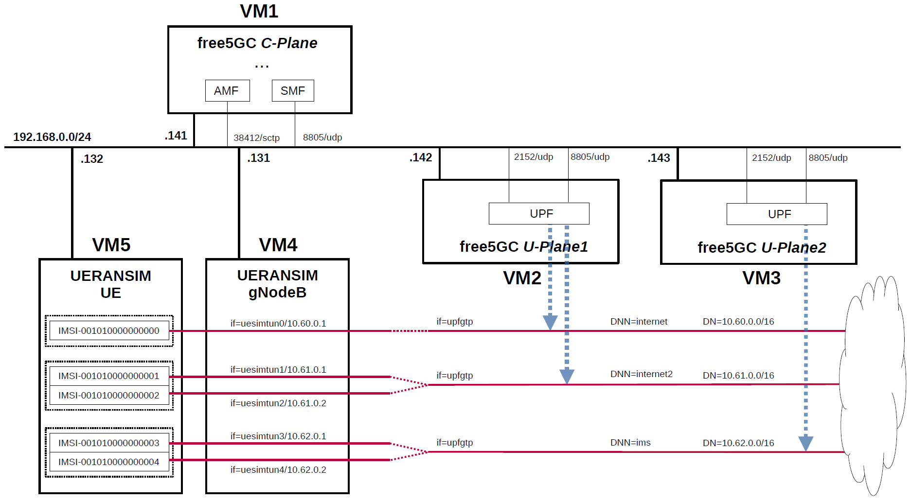

# free5GC 5GC & UERANSIM UE / RAN Sample Configuration
UERANSIM (5G UE & RAN (gNodeB) implementation) supports IPv4 of PDU Session Type from 2020.11.17 version, and the Data Plane facility has been enabled.
Therefore, in order to use U-Plane's DN (Data Network) as a trial, I built a simulation environment for the 5GC mobile network.
This briefly describes the overall and configuration files.

---

<h2 id="toc">Table of Contents</h2>

- [Overview of free5GC 5GC Simulation Mobile Network](#overview)
- [Changes in configuration files of free5GC 5GC and UERANSIM UE / RAN](#changes)
  - [Changes in configuration files of free5GC 5GC C-Plane](#changes_cp)
  - [Changes in configuration files of free5GC 5GC U-Plane1](#changes_up1)
  - [Changes in configuration files of free5GC 5GC U-Plane2](#changes_up2)
  - [Changes in configuration files of UERANSIM UE / RAN](#changes_ueransim)
    - [Changes in configuration files of RAN](#changes_ran)
    - [Changes in configuration files of UE0 (IMSI-001010000000000)](#changes_ue0)
    - [Changes in configuration files of UE1 (IMSI-001010000000001)](#changes_ue1)
    - [Changes in configuration files of UE2 (IMSI-001010000000002)](#changes_ue2)
    - [Changes in configuration files of UE3 (IMSI-001010000000003)](#changes_ue3)
    - [Changes in configuration files of UE4 (IMSI-001010000000004)](#changes_ue4)
- [Network settings of free5GC 5GC and UERANSIM UE / RAN](#network_settings)
  - [Network settings of free5GC 5GC U-Plane1](#network_settings_up1)
  - [Network settings of free5GC 5GC U-Plane2](#network_settings_up2)
- [Build free5GC and UERANSIM](#build)
- [Run free5GC 5GC and UERANSIM UE / RAN](#run)
  - [Run free5GC 5GC U-Plane1 & U-Plane2](#run_up)
  - [Run free5GC 5GC C-Plane](#run_cp)
  - [Run UERANSIM](#run_ueran)
    - [Start gNB](#start_gnb)
    - [Start UE (UE1)](#start_ue)
- [Ping google.com](#ping)
  - [Case for going through DN 10.61.0.0/16](#ping_1)
- [Changelog (summary)](#changelog)

---
<h2 id="overview">Overview of free5GC 5GC Simulation Mobile Network</h2>

I created a 5GC mobile network (Internet reachable) for simulation with the aim of creating an environment in which packets can be sent end-to-end with different DNs for each DNN.

The following minimum configuration was set as a condition.
- C-Plane have multiple U-Planes.
- U-Plane have multiple DNs.
- Multiple UEs connect to same DN.

The built simulation environment is as follows.

</img>

The 5GC / UE / RAN used are as follows.
- 5GC - free5GC v3.1.0 - https://github.com/free5gc/free5gc
- UE / RAN - UERANSIM v3.2.6 - https://github.com/aligungr/UERANSIM

Each VMs are as follows.  
| VM # | SW & Role | IP address | OS | Memory (Min) | HDD (Min) |
| --- | --- | --- | --- | --- | --- |
| VM1 | free5GC 5GC C-Plane | 192.168.0.141/24 | Ubuntu 20.04 | 2GB | 20GB |
| VM2 | free5GC 5GC U-Plane1  | 192.168.0.142/24 | Ubuntu 20.04 | 1GB | 20GB |
| VM3 | free5GC 5GC U-Plane2  | 192.168.0.143/24 | Ubuntu 20.04 | 1GB | 20GB |
| VM4 | UERANSIM RAN (gNodeB) | 192.168.0.131/24 | Ubuntu 20.04 | 1GB | 10GB |
| VM5 | UERANSIM UE | 192.168.0.132/24 | Ubuntu 20.04 | 1GB | 10GB |

Subscriber Information (other information is the same) is as follows.  
**Note. Please select OP or OPc according to the setting of UERANSIM UE configuration files.**  
| UE # | IMSI | DNN | OP/OPc |
| --- | --- | --- | --- |
| UE0 | 001010000000000 | internet | OPc |
| UE1 | 001010000000001 | internet2 | OPc |
| UE2 | 001010000000002 | internet2 | OPc |
| UE3 | 001010000000003 | ims | OPc |
| UE4 | 001010000000004 | ims | OPc |

I registered these information with the free5GC WebUI.  
**Note. As of 2022.04.03, there is a bug that WebConsole cannot properly register IMSI starting with 0. Please refer to [here](https://github.com/free5gc/free5gc/issues/330) to deal with this.**

In addition, [3GPP TS 35.208](https://www.3gpp.org/DynaReport/35208.htm) "4.3 Test Sets" is published by 3GPP as test data for the 3GPP authentication and key generation functions (MILENAGE).

Each DNs are as follows.
| DN | TUNnel interface of DN | DNN | TUNnel interface of UE | U-Plane # |
| --- | --- | --- | --- | --- |
| 10.60.0.0/16 | upfgtp | internet | uesimtun0 | U-Plane1 |
| 10.61.0.0/16 | upfgtp | internet2 | uesimtun1, uesimtun2 | U-Plane1 |
| 10.62.0.0/16 | upfgtp | ims | uesimtun3, uesimtun4 | U-Plane2 |

Additional information.

free5GC 5GC U-Plane worked fine on Raspberry Pi 4 Model B. I used [Ubuntu 20.04 (64bit) for Raspberry Pi 4](https://ubuntu.com/download/raspberry-pi) as the OS. I think it would be convenient to place a compact U-Plane in the edge environment and use it as an end-point for DN.

In addition, I have not confirmed the communication performance.

<h2 id="changes">Changes in configuration files of free5GC 5GC and UERANSIM UE / RAN</h2>

Please refer to the following for building free5GC and UERANSIM respectively.
- free5GC v3.1.0 - https://github.com/free5gc/free5gc/wiki/Installation
- UERANSIM v3.2.6 - https://github.com/aligungr/UERANSIM/wiki/Installation

<h3 id="changes_cp">Changes in configuration files of free5GC 5GC C-Plane</h3>

The combination of DNN and S-NSSAI parameters can be used in the logic that selects UPF as the connection destination by PFCP.

- DNN
- S-NSSAI

For the sake of simplicity, This time, only DNN will be changed. S-NSSAI of all UEs is fixed as `SST=1` and `SD=010203`.

- `free5gc/config/amfcfg.yaml`
```diff
--- amfcfg.yaml.orig    2022-04-01 20:25:53.176313323 +0900
+++ amfcfg.yaml 2022-04-01 20:40:46.893025409 +0900
@@ -5,7 +5,7 @@
 configuration:
   amfName: AMF # the name of this AMF
   ngapIpList:  # the IP list of N2 interfaces on this AMF
-    - 127.0.0.18
+    - 192.168.0.141
   sbi: # Service-based interface information
     scheme: http # the protocol for sbi (http or https)
     registerIPv4: 127.0.0.18 # IP used to register to NRF
@@ -23,18 +23,18 @@
   servedGuamiList: # Guami (Globally Unique AMF ID) list supported by this AMF
     # <GUAMI> = <MCC><MNC><AMF ID>
     - plmnId: # Public Land Mobile Network ID, <PLMN ID> = <MCC><MNC>
-        mcc: 208 # Mobile Country Code (3 digits string, digit: 0~9)
-        mnc: 93 # Mobile Network Code (2 or 3 digits string, digit: 0~9)
+        mcc: 001 # Mobile Country Code (3 digits string, digit: 0~9)
+        mnc: 01 # Mobile Network Code (2 or 3 digits string, digit: 0~9)
       amfId: cafe00 # AMF identifier (3 bytes hex string, range: 000000~FFFFFF)
   supportTaiList:  # the TAI (Tracking Area Identifier) list supported by this AMF
     - plmnId: # Public Land Mobile Network ID, <PLMN ID> = <MCC><MNC>
-        mcc: 208 # Mobile Country Code (3 digits string, digit: 0~9)
-        mnc: 93 # Mobile Network Code (2 or 3 digits string, digit: 0~9)
+        mcc: 001 # Mobile Country Code (3 digits string, digit: 0~9)
+        mnc: 01 # Mobile Network Code (2 or 3 digits string, digit: 0~9)
       tac: 1 # Tracking Area Code (uinteger, range: 0~16777215)
   plmnSupportList: # the PLMNs (Public land mobile network) list supported by this AMF
     - plmnId: # Public Land Mobile Network ID, <PLMN ID> = <MCC><MNC>
-        mcc: 208 # Mobile Country Code (3 digits string, digit: 0~9)
-        mnc: 93 # Mobile Network Code (2 or 3 digits string, digit: 0~9)
+        mcc: 001 # Mobile Country Code (3 digits string, digit: 0~9)
+        mnc: 01 # Mobile Network Code (2 or 3 digits string, digit: 0~9)
       snssaiList: # the S-NSSAI (Single Network Slice Selection Assistance Information) list supported by this AMF
         - sst: 1 # Slice/Service Type (uinteger, range: 0~255)
           sd: 010203 # Slice Differentiator (3 bytes hex string, range: 000000~FFFFFF)
@@ -42,6 +42,8 @@
           sd: 112233 # Slice Differentiator (3 bytes hex string, range: 000000~FFFFFF)
   supportDnnList:  # the DNN (Data Network Name) list supported by this AMF
     - internet
+    - internet2
+    - ims
   nrfUri: http://127.0.0.10:8000 # a valid URI of NRF
   security:  # NAS security parameters
     integrityOrder: # the priority of integrity algorithms
```
- `free5gc/config/ausfcfg.yaml`
```diff
--- ausfcfg.yaml.orig   2022-04-01 20:25:53.176313323 +0900
+++ ausfcfg.yaml        2022-04-03 20:14:00.534684505 +0900
@@ -15,8 +15,8 @@
     - nausf-auth # Nausf_UEAuthentication service
   nrfUri: http://127.0.0.10:8000 # a valid URI of NRF
   plmnSupportList: # the PLMNs (Public Land Mobile Network) list supported by this AUSF
-    - mcc: 208 # Mobile Country Code (3 digits string, digit: 0~9)
-      mnc: 93  # Mobile Network Code (2 or 3 digits string, digit: 0~9)
+    - mcc: 001 # Mobile Country Code (3 digits string, digit: 0~9)
+      mnc: 01  # Mobile Network Code (2 or 3 digits string, digit: 0~9)
     - mcc: 123 # Mobile Country Code (3 digits string, digit: 0~9)
       mnc: 45  # Mobile Network Code (2 or 3 digits string, digit: 0~9)
   groupId: ausfGroup001 # ID for the group of the AUSF
```
- `free5gc/config/nrfcfg.yaml`
```diff
--- nrfcfg.yaml.orig    2022-04-01 20:25:53.177313344 +0900
+++ nrfcfg.yaml 2022-04-01 20:42:46.692661495 +0900
@@ -14,8 +14,8 @@
       pem: config/TLS/nrf.pem # NRF TLS Certificate
       key: config/TLS/nrf.key # NRF TLS Private key
   DefaultPlmnId:
-    mcc: 208 # Mobile Country Code (3 digits string, digit: 0~9)
-    mnc: 93 # Mobile Network Code (2 or 3 digits string, digit: 0~9)
+    mcc: 001 # Mobile Country Code (3 digits string, digit: 0~9)
+    mnc: 01 # Mobile Network Code (2 or 3 digits string, digit: 0~9)
   serviceNameList: # the SBI services provided by this NRF, refer to TS 29.510
     - nnrf-nfm # Nnrf_NFManagement service
     - nnrf-disc # Nnrf_NFDiscovery service
```
- `free5gc/config/nssfcfg.yaml`
```diff
--- nssfcfg.yaml.orig   2022-04-01 20:25:53.177313344 +0900
+++ nssfcfg.yaml        2022-04-01 20:44:09.603628178 +0900
@@ -17,12 +17,12 @@
     - nnssf-nssaiavailability # Nnssf_NSSAIAvailability service
   nrfUri: http://127.0.0.10:8000 # a valid URI of NRF
   supportedPlmnList: # the PLMNs (Public land mobile network) list supported by this NSSF
-    - mcc: 208 # Mobile Country Code (3 digits string, digit: 0~9)
-      mnc: 93 # Mobile Network Code (2 or 3 digits string, digit: 0~9)
+    - mcc: 001 # Mobile Country Code (3 digits string, digit: 0~9)
+      mnc: 01 # Mobile Network Code (2 or 3 digits string, digit: 0~9)
   supportedNssaiInPlmnList: # Supported S-NSSAI List for each PLMN
     - plmnId: # Public Land Mobile Network ID, <PLMN ID> = <MCC><MNC>
-        mcc: 208 # Mobile Country Code (3 digits string, digit: 0~9)
-        mnc: 93 # Mobile Network Code (2 or 3 digits string, digit: 0~9)
+        mcc: 001 # Mobile Country Code (3 digits string, digit: 0~9)
+        mnc: 01 # Mobile Network Code (2 or 3 digits string, digit: 0~9)
       supportedSnssaiList: # Supported S-NSSAIs of the PLMN
         - sst: 1 # Slice/Service Type (uinteger, range: 0~255)
           sd: 010203 # Slice Differentiator (3 bytes hex string, range: 000000~FFFFFF)
```
- `free5gc/config/smfcfg.yaml`
```diff
--- smfcfg.yaml.orig    2022-04-01 20:25:53.177313344 +0900
+++ smfcfg.yaml 2022-04-01 20:54:07.296844993 +0900
@@ -24,26 +24,25 @@
         - dnn: internet # Data Network Name
           dns: # the IP address of DNS
             ipv4: 8.8.8.8
-    - sNssai: # S-NSSAI (Single Network Slice Selection Assistance Information)
-        sst: 1 # Slice/Service Type (uinteger, range: 0~255)
-        sd: 112233 # Slice Differentiator (3 bytes hex string, range: 000000~FFFFFF)
-      dnnInfos: # DNN information list
-        - dnn: internet # Data Network Name
+        - dnn: internet2 # Data Network Name
           dns: # the IP address of DNS
             ipv4: 8.8.8.8
+        - dnn: ims
+          dns:
+            ipv4: 8.8.8.8
   plmnList: # the list of PLMN IDs that this SMF belongs to (optional, remove this key when unnecessary)
-    - mcc: "208" # Mobile Country Code (3 digits string, digit: 0~9)
-      mnc: "93" # Mobile Network Code (2 or 3 digits string, digit: 0~9)
+    - mcc: "001" # Mobile Country Code (3 digits string, digit: 0~9)
+      mnc: "01" # Mobile Network Code (2 or 3 digits string, digit: 0~9)
   locality: area1 # Name of the location where a set of AMF, SMF and UPFs are located
   pfcp: # the IP address of N4 interface on this SMF (PFCP)
-    addr: 127.0.0.1
+    addr: 192.168.0.141
   userplaneInformation: # list of userplane information
     upNodes: # information of userplane node (AN or UPF)
       gNB1: # the name of the node
         type: AN # the type of the node (AN or UPF)
-      UPF:  # the name of the node
+      UPF1:  # the name of the node
         type: UPF # the type of the node (AN or UPF)
-        nodeID: 127.0.0.8 # the IP/FQDN of N4 interface on this UPF (PFCP)
+        nodeID: 192.168.0.142 # the IP/FQDN of N4 interface on this UPF (PFCP)
         sNssaiUpfInfos: # S-NSSAI information list for this UPF
           - sNssai: # S-NSSAI (Single Network Slice Selection Assistance Information)
               sst: 1 # Slice/Service Type (uinteger, range: 0~255)
@@ -52,22 +51,41 @@
               - dnn: internet
                 pools:
                   - cidr: 10.60.0.0/16
-          - sNssai: # S-NSSAI (Single Network Slice Selection Assistance Information)
-              sst: 1 # Slice/Service Type (uinteger, range: 0~255)
-              sd: 112233 # Slice Differentiator (3 bytes hex string, range: 000000~FFFFFF)
-            dnnUpfInfoList: # DNN information list for this S-NSSAI
-              - dnn: internet
+              - dnn: internet2
                 pools:
                   - cidr: 10.61.0.0/16
         interfaces: # Interface list for this UPF
           - interfaceType: N3 # the type of the interface (N3 or N9)
             endpoints: # the IP address of this N3/N9 interface on this UPF
-              - 127.0.0.8
+              - 192.168.0.142
             networkInstance: internet # Data Network Name (DNN)
+          - interfaceType: N3
+            endpoints:
+              - 192.168.0.142
+            networkInstance: internet2
+      UPF2:
+        type: UPF
+        nodeID: 192.168.0.143
+        sNssaiUpfInfos:
+          - sNssai:
+              sst: 1
+              sd: 010203
+            dnnUpfInfoList:
+              - dnn: ims
+                pools:
+                  - cidr: 10.62.0.0/16
+        interfaces:
+          - interfaceType: N3
+            endpoints:
+              - 192.168.0.143
+            networkInstance: ims
     links: # the topology graph of userplane, A and B represent the two nodes of each link
       - A: gNB1
-        B: UPF
+        B: UPF1
+      - A: gNB1
+        B: UPF2
   nrfUri: http://127.0.0.10:8000 # a valid URI of NRF
+  ulcl: false
 
 # the kind of log output
 # debugLevel: how detailed to output, value: trace, debug, info, warn, error, fatal, panic
```

<h3 id="changes_up1">Changes in configuration files of free5GC 5GC U-Plane1</h3>

- `free5gc/NFs/upf/build/config/upfcfg.yaml`
```diff
--- upfcfg.yaml.orig    2022-04-01 20:34:11.333681494 +0900
+++ upfcfg.yaml 2022-04-01 21:00:59.310114539 +0900
@@ -15,12 +15,12 @@
 
   # The IP list of the N4 interface on this UPF (Can't set to 0.0.0.0)
   pfcp:
-    - addr: 127.0.0.8
+    - addr: 192.168.0.142
 
   # The IP list of the N3/N9 interfaces on this UPF
   # If there are multiple connection, set addr to 0.0.0.0 or list all the addresses
   gtpu:
-    - addr: 127.0.0.8
+    - addr: 192.168.0.142
     # [optional] gtpu.name
     # - name: upf.5gc.nctu.me
     # [optional] gtpu.ifname
@@ -32,3 +32,5 @@
       cidr: 10.60.0.0/16 # Classless Inter-Domain Routing for assigned IPv4 pool of UE
       # [optional] dnn_list[*].natifname
       # natifname: eth0
+    - dnn: internet2
+      cidr: 10.61.0.0/16
```

<h3 id="changes_up2">Changes in configuration files of free5GC 5GC U-Plane2</h3>

- `free5gc/NFs/upf/build/config/upfcfg.yaml`
```diff
--- upfcfg.yaml.orig    2022-04-01 20:36:05.833367506 +0900
+++ upfcfg.yaml 2022-04-01 21:03:15.109770860 +0900
@@ -15,12 +15,12 @@
 
   # The IP list of the N4 interface on this UPF (Can't set to 0.0.0.0)
   pfcp:
-    - addr: 127.0.0.8
+    - addr: 192.168.0.143
 
   # The IP list of the N3/N9 interfaces on this UPF
   # If there are multiple connection, set addr to 0.0.0.0 or list all the addresses
   gtpu:
-    - addr: 127.0.0.8
+    - addr: 192.168.0.143
     # [optional] gtpu.name
     # - name: upf.5gc.nctu.me
     # [optional] gtpu.ifname
@@ -28,7 +28,7 @@
 
   # The DNN list supported by UPF
   dnn_list:
-    - dnn: internet # Data Network Name
-      cidr: 10.60.0.0/16 # Classless Inter-Domain Routing for assigned IPv4 pool of UE
+    - dnn: ims # Data Network Name
+      cidr: 10.62.0.0/16 # Classless Inter-Domain Routing for assigned IPv4 pool of UE
       # [optional] dnn_list[*].natifname
       # natifname: eth0
```

<h3 id="changes_ueransim">Changes in configuration files of UERANSIM UE / RAN</h3>

<h4 id="changes_ran">Changes in configuration files of RAN</h4>

- `UERANSIM/config/free5gc-gnb.yaml`
```diff
--- free5gc-gnb.yaml.orig       2021-02-11 11:03:28.000000000 +0900
+++ free5gc-gnb.yaml    2022-04-01 21:43:08.519802520 +0900
@@ -1,17 +1,17 @@
-mcc: '208'          # Mobile Country Code value
-mnc: '93'           # Mobile Network Code value (2 or 3 digits)
+mcc: '001'          # Mobile Country Code value
+mnc: '01'           # Mobile Network Code value (2 or 3 digits)
 
 nci: '0x000000010'  # NR Cell Identity (36-bit)
 idLength: 32        # NR gNB ID length in bits [22...32]
 tac: 1              # Tracking Area Code
 
-linkIp: 127.0.0.1   # gNB's local IP address for Radio Link Simulation (Usually same with local IP)
-ngapIp: 127.0.0.1   # gNB's local IP address for N2 Interface (Usually same with local IP)
-gtpIp: 127.0.0.1    # gNB's local IP address for N3 Interface (Usually same with local IP)
+linkIp: 192.168.0.131   # gNB's local IP address for Radio Link Simulation (Usually same with local IP)
+ngapIp: 192.168.0.131   # gNB's local IP address for N2 Interface (Usually same with local IP)
+gtpIp: 192.168.0.131    # gNB's local IP address for N3 Interface (Usually same with local IP)
 
 # List of AMF address information
 amfConfigs:
-  - address: 127.0.0.1
+  - address: 192.168.0.141
     port: 38412
 
 # List of supported S-NSSAIs by this gNB
```

<h4 id="changes_ue0">Changes in configuration files of UE0 (IMSI-001010000000000)</h4>

First, copy `free5gc-ue0.yaml` from `free5gc-ue.yaml`.
```
# cd UERANSIM/config
# cp free5gc-ue.yaml free5gc-ue0.yaml
```
Next, edit `free5gc-ue0.yaml`.
- `UERANSIM/config/free5gc-ue0.yaml`
```diff
--- free5gc-ue.yaml.orig        2021-09-18 21:11:52.000000000 +0900
+++ free5gc-ue0.yaml    2022-04-01 22:10:37.686699257 +0900
@@ -1,9 +1,9 @@
 # IMSI number of the UE. IMSI = [MCC|MNC|MSISDN] (In total 15 digits)
-supi: 'imsi-208930000000003'
+supi: 'imsi-001010000000000'
 # Mobile Country Code value of HPLMN
-mcc: '208'
+mcc: '001'
 # Mobile Network Code value of HPLMN (2 or 3 digits)
-mnc: '93'
+mnc: '01'
 
 # Permanent subscription key
 key: '8baf473f2f8fd09487cccbd7097c6862'
@@ -20,7 +20,7 @@
 
 # List of gNB IP addresses for Radio Link Simulation
 gnbSearchList:
-  - 127.0.0.1
+  - 192.168.0.131
 
 # UAC Access Identities Configuration
 uacAic:
```

<h4 id="changes_ue1">Changes in configuration files of UE1 (IMSI-001010000000001)</h4>

First, copy `free5gc-ue1.yaml` from `free5gc-ue.yaml`.
```
# cd UERANSIM/config
# cp free5gc-ue.yaml free5gc-ue1.yaml
```
Next, edit `free5gc-ue1.yaml`.
- `UERANSIM/config/free5gc-ue1.yaml`
```diff
--- free5gc-ue.yaml.orig        2021-09-18 21:11:52.000000000 +0900
+++ free5gc-ue1.yaml    2022-04-01 21:47:05.064780302 +0900
@@ -1,9 +1,9 @@
 # IMSI number of the UE. IMSI = [MCC|MNC|MSISDN] (In total 15 digits)
-supi: 'imsi-208930000000003'
+supi: 'imsi-001010000000001'
 # Mobile Country Code value of HPLMN
-mcc: '208'
+mcc: '001'
 # Mobile Network Code value of HPLMN (2 or 3 digits)
-mnc: '93'
+mnc: '01'
 
 # Permanent subscription key
 key: '8baf473f2f8fd09487cccbd7097c6862'
@@ -20,7 +20,7 @@
 
 # List of gNB IP addresses for Radio Link Simulation
 gnbSearchList:
-  - 127.0.0.1
+  - 192.168.0.131
 
 # UAC Access Identities Configuration
 uacAic:
@@ -39,7 +39,7 @@
 # Initial PDU sessions to be established
 sessions:
   - type: 'IPv4'
-    apn: 'internet'
+    apn: 'internet2'
     slice:
       sst: 0x01
       sd: 0x010203
```

<h4 id="changes_ue2">Changes in configuration files of UE2 (IMSI-001010000000002)</h4>

First, copy `free5gc-ue2.yaml` from `free5gc-ue.yaml`.
```
# cd UERANSIM/config
# cp free5gc-ue.yaml free5gc-ue2.yaml
```
Next, edit `free5gc-ue2.yaml`.
- `UERANSIM/config/free5gc-ue2.yaml`
```diff
--- free5gc-ue.yaml.orig        2021-09-18 21:11:52.000000000 +0900
+++ free5gc-ue2.yaml    2022-04-01 21:47:46.128978779 +0900
@@ -1,9 +1,9 @@
 # IMSI number of the UE. IMSI = [MCC|MNC|MSISDN] (In total 15 digits)
-supi: 'imsi-208930000000003'
+supi: 'imsi-001010000000002'
 # Mobile Country Code value of HPLMN
-mcc: '208'
+mcc: '001'
 # Mobile Network Code value of HPLMN (2 or 3 digits)
-mnc: '93'
+mnc: '01'
 
 # Permanent subscription key
 key: '8baf473f2f8fd09487cccbd7097c6862'
@@ -20,7 +20,7 @@
 
 # List of gNB IP addresses for Radio Link Simulation
 gnbSearchList:
-  - 127.0.0.1
+  - 192.168.0.131
 
 # UAC Access Identities Configuration
 uacAic:
@@ -39,7 +39,7 @@
 # Initial PDU sessions to be established
 sessions:
   - type: 'IPv4'
-    apn: 'internet'
+    apn: 'internet2'
     slice:
       sst: 0x01
       sd: 0x010203
```

<h4 id="changes_ue3">Changes in configuration files of UE3 (IMSI-001010000000003)</h4>

First, copy `free5gc-ue3.yaml` from `free5gc-ue.yaml`.
```
# cd UERANSIM/config
# cp free5gc-ue.yaml free5gc-ue3.yaml
```
Next, edit `free5gc-ue3.yaml`.
- `UERANSIM/config/free5gc-ue3.yaml`
```diff
--- free5gc-ue.yaml.orig        2021-09-18 21:11:52.000000000 +0900
+++ free5gc-ue3.yaml    2022-04-01 21:48:36.274214416 +0900
@@ -1,9 +1,9 @@
 # IMSI number of the UE. IMSI = [MCC|MNC|MSISDN] (In total 15 digits)
-supi: 'imsi-208930000000003'
+supi: 'imsi-001010000000003'
 # Mobile Country Code value of HPLMN
-mcc: '208'
+mcc: '001'
 # Mobile Network Code value of HPLMN (2 or 3 digits)
-mnc: '93'
+mnc: '01'
 
 # Permanent subscription key
 key: '8baf473f2f8fd09487cccbd7097c6862'
@@ -20,7 +20,7 @@
 
 # List of gNB IP addresses for Radio Link Simulation
 gnbSearchList:
-  - 127.0.0.1
+  - 192.168.0.131
 
 # UAC Access Identities Configuration
 uacAic:
@@ -39,7 +39,7 @@
 # Initial PDU sessions to be established
 sessions:
   - type: 'IPv4'
-    apn: 'internet'
+    apn: 'ims'
     slice:
       sst: 0x01
       sd: 0x010203
```

<h4 id="changes_ue4">Changes in configuration files of UE4 (IMSI-001010000000004)</h4>

First, copy `free5gc-ue4.yaml` from `free5gc-ue.yaml`.
```
# cd UERANSIM/config
# cp free5gc-ue.yaml free5gc-ue4.yaml
```
Next, edit `free5gc-ue4.yaml`.
- `UERANSIM/config/free5gc-ue4.yaml`
```diff
--- free5gc-ue.yaml.orig        2021-09-18 21:11:52.000000000 +0900
+++ free5gc-ue4.yaml    2022-04-01 21:49:14.312388653 +0900
@@ -1,9 +1,9 @@
 # IMSI number of the UE. IMSI = [MCC|MNC|MSISDN] (In total 15 digits)
-supi: 'imsi-208930000000003'
+supi: 'imsi-001010000000004'
 # Mobile Country Code value of HPLMN
-mcc: '208'
+mcc: '001'
 # Mobile Network Code value of HPLMN (2 or 3 digits)
-mnc: '93'
+mnc: '01'
 
 # Permanent subscription key
 key: '8baf473f2f8fd09487cccbd7097c6862'
@@ -20,7 +20,7 @@
 
 # List of gNB IP addresses for Radio Link Simulation
 gnbSearchList:
-  - 127.0.0.1
+  - 192.168.0.131
 
 # UAC Access Identities Configuration
 uacAic:
@@ -39,7 +39,7 @@
 # Initial PDU sessions to be established
 sessions:
   - type: 'IPv4'
-    apn: 'internet'
+    apn: 'ims'
     slice:
       sst: 0x01
       sd: 0x010203
```

<h2 id="network_settings">Network settings of free5GC 5GC and UERANSIM UE / RAN</h2>

<h3 id="network_settings_up1">Network settings of free5GC 5GC U-Plane1</h3>

First, uncomment the next line in the `/etc/sysctl.conf` file and reflect it in the OS.
```
net.ipv4.ip_forward=1
```
```
# sysctl -p
```
Next, configure NAPT.
```
# iptables -t nat -A POSTROUTING -s 10.60.0.0/16 ! -o upfgtp -j MASQUERADE
# iptables -t nat -A POSTROUTING -s 10.61.0.0/16 ! -o upfgtp -j MASQUERADE
```

<h3 id="network_settings_up2">Network settings of free5GC 5GC U-Plane2</h3>

First, uncomment the next line in the `/etc/sysctl.conf` file and reflect it in the OS.
```
net.ipv4.ip_forward=1
```
```
# sysctl -p
```
Next, configure NAPT.
```
# iptables -t nat -A POSTROUTING -s 10.62.0.0/16 ! -o upfgtp -j MASQUERADE
```

<h2 id="build">Build free5GC and UERANSIM</h2>

Please refer to the following for building free5GC and UERANSIM respectively.
- free5GC v3.1.0 - https://github.com/free5gc/free5gc/wiki/Installation
- UERANSIM v3.2.6 - https://github.com/aligungr/UERANSIM/wiki/Installation

Note. Install MongoDB with package manager on free5GC 5GC C-Plane machine.
[MongoDB Compass](https://www.mongodb.com/products/compass) is a convenient tool to look at the MongoDB database.
```
# apt update
# apt install mongodb
# systemctl start mongodb
# systemctl enable mongodb
```
It is not necessary to install MongoDB on free5GC 5GC U-Plane machines.

**Note. If you want to use the latest committed version, please run the following script to checkout all NFs and Web Console to the latest `main` branch before building.**
```
#!/usr/bin/env bash

NF_LIST="nrf amf smf udr pcf udm nssf ausf upf n3iwf"

for NF in ${NF_LIST}; do
    cd NFs/${NF}
    git checkout main
    cd ../..
done

cd webconsole
git checkout main

cd ..
git checkout main
```

<h2 id="run">Run free5GC 5GC and UERANSIM UE / RAN</h2>

First run the 5GC, then UERANSIM (UE & RAN implementation).

<h3 id="run_up">Run free5GC 5GC U-Plane1 & U-Plane2</h3>

First, run free5GC 5GC U-Planes. Please see [here](https://github.com/free5gc/free5gc/issues/170#issuecomment-773214169) for the reason.

- free5GC 5GC U-Plane1
```
# cd free5gc/NFs/upf/build
# bin/free5gc-upfd
```
- free5GC 5GC U-Plane2
```
# cd free5gc/NFs/upf/build
# bin/free5gc-upfd
```

<h3 id="run_cp">Run free5GC 5GC C-Plane</h3>

Next, run free5GC 5GC C-Plane.

- free5GC 5GC C-Plane

Create the following shell script and run it.
```
#!/usr/bin/env bash

PID_LIST=()

NF_LIST="nrf amf smf udr pcf udm nssf ausf"

export GIN_MODE=release

for NF in ${NF_LIST}; do
    ./bin/${NF} &
    PID_LIST+=($!)
    sleep 1
done

function terminate()
{
    sudo kill -SIGTERM ${PID_LIST[${#PID_LIST[@]}-2]} ${PID_LIST[${#PID_LIST[@]}-1]}
    sleep 2
}

trap terminate SIGINT
wait ${PID_LIST}
```

<h3 id="run_ueran">Run UERANSIM</h3>

Here, the case of UE1 (IMSI-001010000000001 set as **DNN=internet2**) & RAN is described.
First, do an NG Setup between gNodeB and 5GC, then register the UE with 5GC and establish a PDU session.

Please refer to the following for usage of UERANSIM.

https://github.com/aligungr/UERANSIM/wiki/Usage

<h4 id="start_gnb">Start gNB</h4>

Start gNB as follows.
```
# ./nr-gnb -c ../config/free5gc-gnb.yaml
UERANSIM v3.2.6
[2022-04-03 20:28:44.358] [sctp] [info] Trying to establish SCTP connection... (192.168.0.141:38412)
[2022-04-03 20:28:44.361] [sctp] [info] SCTP connection established (192.168.0.141:38412)
[2022-04-03 20:28:44.361] [sctp] [debug] SCTP association setup ascId[6]
[2022-04-03 20:28:44.362] [ngap] [debug] Sending NG Setup Request
[2022-04-03 20:28:44.364] [ngap] [debug] NG Setup Response received
[2022-04-03 20:28:44.364] [ngap] [info] NG Setup procedure is successful
```
The free5GC C-Plane log when executed is as follows.
```
2022-04-03T20:28:44+09:00 [INFO][AMF][NGAP] [AMF] SCTP Accept from: 192.168.0.131:54644
2022-04-03T20:28:44+09:00 [INFO][AMF][NGAP] Create a new NG connection for: 192.168.0.131:54644
2022-04-03T20:28:44+09:00 [INFO][AMF][NGAP][192.168.0.131:54644] Handle NG Setup request
2022-04-03T20:28:44+09:00 [INFO][AMF][NGAP][192.168.0.131:54644] Send NG-Setup response
```

<h4 id="start_ue">Start UE (UE1)</h4>

Start UE (UE1) as follows. This will register the UE with 5GC and establish a PDU session.
```
# ./nr-ue -c ../config/free5gc-ue1.yaml 
UERANSIM v3.2.6
[2022-04-03 20:30:27.993] [nas] [info] UE switches to state [MM-DEREGISTERED/PLMN-SEARCH]
[2022-04-03 20:30:27.993] [rrc] [debug] New signal detected for cell[1], total [1] cells in coverage
[2022-04-03 20:30:27.994] [nas] [info] Selected plmn[001/01]
[2022-04-03 20:30:27.994] [rrc] [info] Selected cell plmn[001/01] tac[1] category[SUITABLE]
[2022-04-03 20:30:27.995] [nas] [info] UE switches to state [MM-DEREGISTERED/PS]
[2022-04-03 20:30:27.995] [nas] [info] UE switches to state [MM-DEREGISTERED/NORMAL-SERVICE]
[2022-04-03 20:30:27.995] [nas] [debug] Initial registration required due to [MM-DEREG-NORMAL-SERVICE]
[2022-04-03 20:30:27.996] [nas] [debug] UAC access attempt is allowed for identity[0], category[MO_sig]
[2022-04-03 20:30:27.996] [nas] [debug] Sending Initial Registration
[2022-04-03 20:30:27.996] [nas] [info] UE switches to state [MM-REGISTER-INITIATED]
[2022-04-03 20:30:27.997] [rrc] [debug] Sending RRC Setup Request
[2022-04-03 20:30:27.998] [rrc] [info] RRC connection established
[2022-04-03 20:30:27.998] [rrc] [info] UE switches to state [RRC-CONNECTED]
[2022-04-03 20:30:27.999] [nas] [info] UE switches to state [CM-CONNECTED]
[2022-04-03 20:30:28.033] [nas] [debug] Authentication Request received
[2022-04-03 20:30:28.039] [nas] [debug] Security Mode Command received
[2022-04-03 20:30:28.039] [nas] [debug] Selected integrity[2] ciphering[0]
[2022-04-03 20:30:28.068] [nas] [debug] Registration accept received
[2022-04-03 20:30:28.068] [nas] [info] UE switches to state [MM-REGISTERED/NORMAL-SERVICE]
[2022-04-03 20:30:28.069] [nas] [debug] Sending Registration Complete
[2022-04-03 20:30:28.069] [nas] [info] Initial Registration is successful
[2022-04-03 20:30:28.069] [nas] [debug] Sending PDU Session Establishment Request
[2022-04-03 20:30:28.069] [nas] [debug] UAC access attempt is allowed for identity[0], category[MO_sig]
[2022-04-03 20:30:28.321] [nas] [debug] PDU Session Establishment Accept received
[2022-04-03 20:30:28.325] [nas] [info] PDU Session establishment is successful PSI[1]
[2022-04-03 20:30:28.345] [app] [info] Connection setup for PDU session[1] is successful, TUN interface[uesimtun0, 10.61.0.1] is up.
```
The free5GC C-Plane log when executed is as follows.
```
2022-04-03T20:30:28+09:00 [INFO][AMF][NGAP][192.168.0.131:54644] Handle Initial UE Message
2022-04-03T20:30:28+09:00 [INFO][LIB][FSM] Handle event[Gmm Message], transition from [Deregistered] to [Deregistered]
2022-04-03T20:30:28+09:00 [INFO][AMF][GMM][AMF_UE_NGAP_ID:2] Handle Registration Request
2022-04-03T20:30:28+09:00 [INFO][LIB][FSM] Handle event[Start Authentication], transition from [Deregistered] to [Authentication]
2022-04-03T20:30:28+09:00 [INFO][AMF][GMM][AMF_UE_NGAP_ID:2] Authentication procedure
2022-04-03T20:30:28+09:00 [INFO][NRF][DSCV] Handle NFDiscoveryRequest
2022-04-03T20:30:28+09:00 [INFO][NRF][GIN] | 200 |       127.0.0.1 | GET     | /nnrf-disc/v1/nf-instances?requester-nf-type=AMF&target-nf-type=AUSF |
2022-04-03T20:30:28+09:00 [INFO][AUSF][UeAuthPost] HandleUeAuthPostRequest
2022-04-03T20:30:28+09:00 [INFO][AUSF][UeAuthPost] Serving network authorized
2022-04-03T20:30:28+09:00 [INFO][NRF][DSCV] Handle NFDiscoveryRequest
2022-04-03T20:30:28+09:00 [INFO][NRF][GIN] | 200 |       127.0.0.1 | GET     | /nnrf-disc/v1/nf-instances?requester-nf-type=AUSF&service-names=nudm-ueau&target-nf-type=UDM |
2022-04-03T20:30:28+09:00 [INFO][UDM][UEAU] Handle GenerateAuthDataRequest
2022-04-03T20:30:28+09:00 [INFO][UDM][Suci] suciPart: [suci 0 001 01 0000 0 0 0000000001]
2022-04-03T20:30:28+09:00 [INFO][UDM][Suci] scheme 0
2022-04-03T20:30:28+09:00 [INFO][UDM][Suci] SUPI type is IMSI
http://127.0.0.10:8000
2022-04-03T20:30:28+09:00 [INFO][NRF][DSCV] Handle NFDiscoveryRequest
2022-04-03T20:30:28+09:00 [INFO][NRF][GIN] | 200 |       127.0.0.1 | GET     | /nnrf-disc/v1/nf-instances?requester-nf-type=UDM&target-nf-type=UDR |
2022-04-03T20:30:28+09:00 [INFO][UDR][DRepo] Handle QueryAuthSubsData
2022-04-03T20:30:28+09:00 [INFO][UDR][GIN] | 200 |       127.0.0.1 | GET     | /nudr-dr/v1/subscription-data/imsi-001010000000001/authentication-data/authentication-subscription |
2022-04-03T20:30:28+09:00 [ERRO][UDM][UEAU] opStr length is  0
2022-04-03T20:30:28+09:00 [INFO][UDR][DRepo] Handle ModifyAuthentication
2022-04-03T20:30:28+09:00 [INFO][UDR][GIN] | 204 |       127.0.0.1 | PATCH   | /nudr-dr/v1/subscription-data/imsi-001010000000001/authentication-data/authentication-subscription |
2022-04-03T20:30:28+09:00 [INFO][UDM][GIN] | 200 |       127.0.0.1 | POST    | /nudm-ueau/v1/suci-0-001-01-0000-0-0-0000000001/security-information/generate-auth-data |
2022-04-03T20:30:28+09:00 [INFO][AUSF][UeAuthPost] Add SuciSupiPair (suci-0-001-01-0000-0-0-0000000001, imsi-001010000000001) to map.
2022-04-03T20:30:28+09:00 [INFO][AUSF][UeAuthPost] Use 5G AKA auth method
2022-04-03T20:30:28+09:00 [INFO][AUSF][5gAkaAuth] XresStar = 6338353637666131633163303361623766353636376431353266313733376439
2022-04-03T20:30:28+09:00 [INFO][AUSF][GIN] | 201 |       127.0.0.1 | POST    | /nausf-auth/v1/ue-authentications |
2022-04-03T20:30:28+09:00 [INFO][AMF][GMM][AMF_UE_NGAP_ID:2] Send Authentication Request
2022-04-03T20:30:28+09:00 [INFO][AMF][NGAP][192.168.0.131:54644][AMF_UE_NGAP_ID:2] Send Downlink Nas Transport
2022-04-03T20:30:28+09:00 [INFO][AMF][NGAP][192.168.0.131:54644][AMF_UE_NGAP_ID:2] Uplink NAS Transport (RAN UE NGAP ID: 2)
2022-04-03T20:30:28+09:00 [INFO][LIB][FSM] Handle event[Gmm Message], transition from [Authentication] to [Authentication]
2022-04-03T20:30:28+09:00 [INFO][AMF][GMM][AMF_UE_NGAP_ID:2] Handle Authentication Response
2022-04-03T20:30:28+09:00 [INFO][AUSF][5gAkaAuth] Auth5gAkaComfirmRequest
2022-04-03T20:30:28+09:00 [INFO][AUSF][5gAkaAuth] res*: 6338353637666131633163303361623766353636376431353266313733376439
Xres*: 6338353637666131633163303361623766353636376431353266313733376439
2022-04-03T20:30:28+09:00 [INFO][AUSF][5gAkaAuth] 5G AKA confirmation succeeded
2022-04-03T20:30:28+09:00 [INFO][UDM][UEAU] Handle ConfirmAuthDataRequest
2022-04-03T20:30:28+09:00 [INFO][UDR][DRepo] Handle CreateAuthenticationStatus
2022-04-03T20:30:28+09:00 [INFO][UDR][GIN] | 204 |       127.0.0.1 | PUT     | /nudr-dr/v1/subscription-data/imsi-001010000000001/authentication-data/authentication-status |
2022-04-03T20:30:28+09:00 [INFO][UDM][GIN] | 201 |       127.0.0.1 | POST    | /nudm-ueau/v1/imsi-001010000000001/auth-events |
2022-04-03T20:30:28+09:00 [INFO][AUSF][GIN] | 200 |       127.0.0.1 | PUT     | /nausf-auth/v1/ue-authentications/suci-0-001-01-0000-0-0-0000000001/5g-aka-confirmation |
2022-04-03T20:30:28+09:00 [INFO][LIB][FSM] Handle event[Authentication Success], transition from [Authentication] to [SecurityMode]
2022-04-03T20:30:28+09:00 [INFO][AMF][GMM][AMF_UE_NGAP_ID:2][SUPI:imsi-001010000000001] Send Security Mode Command
2022-04-03T20:30:28+09:00 [INFO][AMF][NGAP][192.168.0.131:54644][AMF_UE_NGAP_ID:2] Send Downlink Nas Transport
2022-04-03T20:30:28+09:00 [INFO][AMF][NGAP][192.168.0.131:54644][AMF_UE_NGAP_ID:2] Uplink NAS Transport (RAN UE NGAP ID: 2)
2022-04-03T20:30:28+09:00 [INFO][LIB][FSM] Handle event[Gmm Message], transition from [SecurityMode] to [SecurityMode]
2022-04-03T20:30:28+09:00 [INFO][AMF][GMM][AMF_UE_NGAP_ID:2][SUPI:imsi-001010000000001] Handle Security Mode Complete
2022-04-03T20:30:28+09:00 [INFO][LIB][FSM] Handle event[SecurityMode Success], transition from [SecurityMode] to [ContextSetup]
2022-04-03T20:30:28+09:00 [INFO][AMF][GMM][AMF_UE_NGAP_ID:2][SUPI:imsi-001010000000001] Handle InitialRegistration
2022-04-03T20:30:28+09:00 [INFO][NRF][DSCV] Handle NFDiscoveryRequest
2022-04-03T20:30:28+09:00 [INFO][NRF][GIN] | 200 |       127.0.0.1 | GET     | /nnrf-disc/v1/nf-instances?requester-nf-type=AMF&supi=imsi-001010000000001&target-nf-type=UDM |
2022-04-03T20:30:28+09:00 [INFO][UDM][SDM] Handle GetNssai
2022-04-03T20:30:28+09:00 [INFO][UDR][DRepo] Handle QueryAmData
2022-04-03T20:30:28+09:00 [INFO][UDR][GIN] | 200 |       127.0.0.1 | GET     | /nudr-dr/v1/subscription-data/imsi-001010000000001/00101/provisioned-data/am-data?supported-features= |
2022-04-03T20:30:28+09:00 [INFO][UDM][GIN] | 200 |       127.0.0.1 | GET     | /nudm-sdm/v1/imsi-001010000000001/nssai?plmn-id=%7B%22mcc%22%3A%22001%22%2C%22mnc%22%3A%2201%22%7D |
2022-04-03T20:30:28+09:00 [INFO][AMF][GMM][AMF_UE_NGAP_ID:2][SUPI:imsi-001010000000001] RequestedNssai - ServingSnssai: &{Sst:1 Sd:010203}, HomeSnssai: <nil>
2022-04-03T20:30:28+09:00 [INFO][NRF][DSCV] Handle NFDiscoveryRequest
2022-04-03T20:30:28+09:00 [INFO][NRF][GIN] | 200 |       127.0.0.1 | GET     | /nnrf-disc/v1/nf-instances?requester-nf-type=AMF&supi=imsi-001010000000001&target-nf-type=UDM |
2022-04-03T20:30:28+09:00 [INFO][UDM][UECM] Handle RegistrationAmf3gppAccess
2022-04-03T20:30:28+09:00 [INFO][UDM][UECM] UEID: imsi-001010000000001
2022-04-03T20:30:28+09:00 [INFO][UDR][DRepo] Handle CreateAmfContext3gpp
2022-04-03T20:30:28+09:00 [INFO][UDR][GIN] | 204 |       127.0.0.1 | PUT     | /nudr-dr/v1/subscription-data/imsi-001010000000001/context-data/amf-3gpp-access |
2022-04-03T20:30:28+09:00 [INFO][UDM][GIN] | 201 |       127.0.0.1 | PUT     | /nudm-uecm/v1/imsi-001010000000001/registrations/amf-3gpp-access |
2022-04-03T20:30:28+09:00 [INFO][UDM][SDM] Handle GetAmData
2022-04-03T20:30:28+09:00 [INFO][UDR][DRepo] Handle QueryAmData
2022-04-03T20:30:28+09:00 [INFO][UDR][GIN] | 200 |       127.0.0.1 | GET     | /nudr-dr/v1/subscription-data/imsi-001010000000001/00101/provisioned-data/am-data?supported-features=%7B%22mcc%22%3A%22001%22%2C%22mnc%22%3A%2201%22%7D |
2022-04-03T20:30:28+09:00 [INFO][UDM][GIN] | 200 |       127.0.0.1 | GET     | /nudm-sdm/v1/imsi-001010000000001/am-data?plmn-id=%7B%22mcc%22%3A%22001%22%2C%22mnc%22%3A%2201%22%7D |
2022-04-03T20:30:28+09:00 [INFO][UDM][SDM] Handle GetSmfSelectData
2022-04-03T20:30:28+09:00 [INFO][UDR][DRepo] Handle QuerySmfSelectData
2022-04-03T20:30:28+09:00 [INFO][UDR][GIN] | 200 |       127.0.0.1 | GET     | /nudr-dr/v1/subscription-data/imsi-001010000000001/00101/provisioned-data/smf-selection-subscription-data?supported-features= |
2022-04-03T20:30:28+09:00 [INFO][UDM][GIN] | 200 |       127.0.0.1 | GET     | /nudm-sdm/v1/imsi-001010000000001/smf-select-data?plmn-id=%7B%22mcc%22%3A%22001%22%2C%22mnc%22%3A%2201%22%7D |
2022-04-03T20:30:28+09:00 [INFO][UDM][SDM] Handle GetUeContextInSmfData
2022-04-03T20:30:28+09:00 [INFO][UDR][DRepo] Handle QuerySmfRegList
2022-04-03T20:30:28+09:00 [INFO][UDR][GIN] | 200 |       127.0.0.1 | GET     | /nudr-dr/v1/subscription-data/imsi-001010000000001/context-data/smf-registrations?supported-features= |
2022-04-03T20:30:28+09:00 [INFO][UDM][GIN] | 200 |       127.0.0.1 | GET     | /nudm-sdm/v1/imsi-001010000000001/ue-context-in-smf-data |
2022-04-03T20:30:28+09:00 [INFO][UDM][SDM] Handle Subscribe
2022-04-03T20:30:28+09:00 [INFO][UDR][DRepo] Handle CreateSdmSubscriptions
2022-04-03T20:30:28+09:00 [INFO][UDR][GIN] | 201 |       127.0.0.1 | POST    | /nudr-dr/v1/subscription-data/imsi-001010000000001/context-data/sdm-subscriptions |
2022-04-03T20:30:28+09:00 [INFO][UDM][GIN] | 201 |       127.0.0.1 | POST    | /nudm-sdm/v1/imsi-001010000000001/sdm-subscriptions |
2022-04-03T20:30:28+09:00 [INFO][NRF][DSCV] Handle NFDiscoveryRequest
2022-04-03T20:30:28+09:00 [INFO][NRF][GIN] | 200 |       127.0.0.1 | GET     | /nnrf-disc/v1/nf-instances?preferred-locality=area1&requester-nf-type=AMF&supi=imsi-001010000000001&target-nf-type=PCF |
2022-04-03T20:30:28+09:00 [INFO][PCF][Ampolicy] Handle AM Policy Create Request
2022-04-03T20:30:28+09:00 [INFO][NRF][DSCV] Handle NFDiscoveryRequest
2022-04-03T20:30:28+09:00 [INFO][NRF][GIN] | 200 |       127.0.0.1 | GET     | /nnrf-disc/v1/nf-instances?requester-nf-type=PCF&target-nf-type=UDR |
2022-04-03T20:30:28+09:00 [INFO][UDR][DRepo] Handle PolicyDataUesUeIdAmDataGet
2022-04-03T20:30:28+09:00 [INFO][UDR][GIN] | 200 |       127.0.0.1 | GET     | /nudr-dr/v1/policy-data/ues/imsi-001010000000001/am-data |
2022-04-03T20:30:28+09:00 [INFO][PCF][GIN] | 201 |       127.0.0.1 | POST    | /npcf-am-policy-control/v1/policies |
2022-04-03T20:30:28+09:00 [INFO][AMF][GMM][AMF_UE_NGAP_ID:2][SUPI:imsi-001010000000001] Send Registration Accept
2022-04-03T20:30:28+09:00 [INFO][AMF][NGAP][192.168.0.131:54644][AMF_UE_NGAP_ID:2] Send Initial Context Setup Request
2022-04-03T20:30:28+09:00 [INFO][AMF][NGAP][192.168.0.131:54644][AMF_UE_NGAP_ID:2] Handle Initial Context Setup Response
2022-04-03T20:30:28+09:00 [INFO][AMF][NGAP][192.168.0.131:54644][AMF_UE_NGAP_ID:2] Uplink NAS Transport (RAN UE NGAP ID: 2)
2022-04-03T20:30:28+09:00 [INFO][LIB][FSM] Handle event[Gmm Message], transition from [ContextSetup] to [ContextSetup]
2022-04-03T20:30:28+09:00 [INFO][AMF][GMM][AMF_UE_NGAP_ID:2][SUPI:imsi-001010000000001] Handle Registration Complete
2022-04-03T20:30:28+09:00 [INFO][LIB][FSM] Handle event[ContextSetup Success], transition from [ContextSetup] to [Registered]
2022-04-03T20:30:28+09:00 [INFO][AMF][NGAP][192.168.0.131:54644][AMF_UE_NGAP_ID:2] Uplink NAS Transport (RAN UE NGAP ID: 2)
2022-04-03T20:30:28+09:00 [INFO][LIB][FSM] Handle event[Gmm Message], transition from [Registered] to [Registered]
2022-04-03T20:30:28+09:00 [INFO][AMF][GMM][AMF_UE_NGAP_ID:2][SUPI:imsi-001010000000001] Handle UL NAS Transport
2022-04-03T20:30:28+09:00 [INFO][AMF][GMM][AMF_UE_NGAP_ID:2][SUPI:imsi-001010000000001] Transport 5GSM Message to SMF
2022-04-03T20:30:28+09:00 [INFO][AMF][GMM][AMF_UE_NGAP_ID:2][SUPI:imsi-001010000000001] Select SMF [snssai: {Sst:1 Sd:010203}, dnn: internet2]
2022-04-03T20:30:28+09:00 [INFO][NRF][DSCV] Handle NFDiscoveryRequest
2022-04-03T20:30:28+09:00 [INFO][NRF][GIN] | 200 |       127.0.0.1 | GET     | /nnrf-disc/v1/nf-instances?requester-nf-type=AMF&target-nf-type=NSSF |
2022-04-03T20:30:28+09:00 [INFO][NSSF][NsSelect] Handle NSSelectionGet
2022-04-03T20:30:28+09:00 [INFO][NSSF][GIN] | 200 |       127.0.0.1 | GET     | /nnssf-nsselection/v1/network-slice-information?nf-id=3a903829-c6a7-4361-ac5b-42b8e87b8aa5&nf-type=AMF&slice-info-request-for-pdu-session=%7B%22sNssai%22%3A%7B%22sst%22%3A1%2C%22sd%22%3A%22010203%22%7D%2C%22roamingIndication%22%3A%22NON_ROAMING%22%7D |
2022-04-03T20:30:28+09:00 [INFO][NRF][DSCV] Handle NFDiscoveryRequest
2022-04-03T20:30:28+09:00 [INFO][NRF][GIN] | 200 |       127.0.0.1 | GET     | /nnrf-disc/v1/nf-instances?dnn=internet2&preferred-locality=area1&requester-nf-type=AMF&service-names=nsmf-pdusession&snssais=%7B%22sst%22%3A1%2C%22sd%22%3A%22010203%22%7D&target-nf-type=SMF&target-plmn-list=%7B%22mcc%22%3A%22001%22%2C%22mnc%22%3A%2201%22%7D |
2022-04-03T20:30:28+09:00 [INFO][SMF][PduSess] Receive Create SM Context Request
2022-04-03T20:30:28+09:00 [INFO][SMF][PduSess] In HandlePDUSessionSMContextCreate
2022-04-03T20:30:28+09:00 [INFO][NRF][DSCV] Handle NFDiscoveryRequest
2022-04-03T20:30:28+09:00 [INFO][NRF][GIN] | 200 |       127.0.0.1 | GET     | /nnrf-disc/v1/nf-instances?requester-nf-type=SMF&target-nf-type=UDM |
2022-04-03T20:30:28+09:00 [INFO][SMF][PduSess] Send NF Discovery Serving UDM Successfully
2022-04-03T20:30:28+09:00 [INFO][SMF][CTX] Allocated UE IP address: 10.61.0.1
2022-04-03T20:30:28+09:00 [INFO][SMF][CTX] Selected UPF: UPF1
2022-04-03T20:30:28+09:00 [INFO][SMF][PduSess] UE[imsi-001010000000001] PDUSessionID[1] IP[10.61.0.1]
2022-04-03T20:30:28+09:00 [INFO][UDM][SDM] Handle GetSmData
2022-04-03T20:30:28+09:00 [INFO][UDM][SDM] getSmDataProcedure: SUPI[imsi-001010000000001] PLMNID[00101] DNN[internet2] SNssai[{"sst":1,"sd":"010203"}]
2022-04-03T20:30:28+09:00 [INFO][UDR][DRepo] Handle QuerySmData
2022-04-03T20:30:28+09:00 [INFO][UDR][GIN] | 200 |       127.0.0.1 | GET     | /nudr-dr/v1/subscription-data/imsi-001010000000001/00101/provisioned-data/sm-data?single-nssai=%7B%22sst%22%3A1%2C%22sd%22%3A%22010203%22%7D |
2022-04-03T20:30:28+09:00 [INFO][UDM][GIN] | 200 |       127.0.0.1 | GET     | /nudm-sdm/v1/imsi-001010000000001/sm-data?dnn=internet2&plmn-id=%7B%22mcc%22%3A%22001%22%2C%22mnc%22%3A%2201%22%7D&single-nssai=%7B%22sst%22%3A1%2C%22sd%22%3A%22010203%22%7D |
2022-04-03T20:30:28+09:00 [INFO][SMF][GSM] In HandlePDUSessionEstablishmentRequest
2022-04-03T20:30:28+09:00 [INFO][NAS][Convert] ProtocolOrContainerList:  [0xc000431120 0xc000431160]
2022-04-03T20:30:28+09:00 [INFO][SMF][GSM] Protocol Configuration Options
2022-04-03T20:30:28+09:00 [INFO][SMF][GSM] &{[0xc000431120 0xc000431160]}
2022-04-03T20:30:28+09:00 [INFO][SMF][GSM] Didn't Implement container type IPAddressAllocationViaNASSignallingUL
2022-04-03T20:30:28+09:00 [INFO][SMF][PduSess] PCF Selection for SMContext SUPI[imsi-001010000000001] PDUSessionID[1]
2022-04-03T20:30:28+09:00 [INFO][NRF][DSCV] Handle NFDiscoveryRequest
2022-04-03T20:30:28+09:00 [INFO][NRF][GIN] | 200 |       127.0.0.1 | GET     | /nnrf-disc/v1/nf-instances?preferred-locality=area1&requester-nf-type=SMF&target-nf-type=PCF |
2022-04-03T20:30:28+09:00 [INFO][PCF][SMpolicy] Handle CreateSmPolicy
2022-04-03T20:30:28+09:00 [INFO][UDR][DRepo] Handle PolicyDataUesUeIdSmDataGet
2022-04-03T20:30:28+09:00 [INFO][UDR][GIN] | 200 |       127.0.0.1 | GET     | /nudr-dr/v1/policy-data/ues/imsi-001010000000001/sm-data?dnn=internet2&snssai=%7B%22sst%22%3A1%2C%22sd%22%3A%22010203%22%7D |
2022-04-03T20:30:28+09:00 [INFO][PCF][GIN] | 201 |       127.0.0.1 | POST    | /npcf-smpolicycontrol/v1/sm-policies |
2022-04-03T20:30:28+09:00 [INFO][SMF][PduSess] SUPI[imsi-001010000000001] has no pre-config route
2022-04-03T20:30:28+09:00 [INFO][NRF][DSCV] Handle NFDiscoveryRequest
2022-04-03T20:30:28+09:00 [INFO][NRF][GIN] | 200 |       127.0.0.1 | GET     | /nnrf-disc/v1/nf-instances?requester-nf-type=SMF&target-nf-instance-id=3a903829-c6a7-4361-ac5b-42b8e87b8aa5&target-nf-type=AMF |
2022-04-03T20:30:28+09:00 [INFO][SMF][Consumer] SendNFDiscoveryServingAMF ok
2022-04-03T20:30:28+09:00 [INFO][SMF][GIN] | 201 |       127.0.0.1 | POST    | /nsmf-pdusession/v1/sm-contexts |
2022-04-03T20:30:28+09:00 [INFO][AMF][GMM][AMF_UE_NGAP_ID:2][SUPI:imsi-001010000000001] create smContext[pduSessionID: 1] Success
2022-04-03T20:30:28+09:00 [INFO][SMF][PFCP] In HandlePfcpSessionEstablishmentResponse
2022-04-03T20:30:28+09:00 [INFO][LIB][PFCP] Remove Request Transaction [5]
2022-04-03T20:30:28+09:00 [INFO][AMF][Producer] Handle N1N2 Message Transfer Request
2022-04-03T20:30:28+09:00 [INFO][AMF][NGAP][192.168.0.131:54644][AMF_UE_NGAP_ID:2] Send PDU Session Resource Setup Request
2022-04-03T20:30:28+09:00 [INFO][AMF][GIN] | 200 |       127.0.0.1 | POST    | /namf-comm/v1/ue-contexts/imsi-001010000000001/n1-n2-messages |
2022-04-03T20:30:28+09:00 [INFO][AMF][NGAP][192.168.0.131:54644][AMF_UE_NGAP_ID:2] Handle PDU Session Resource Setup Response
2022-04-03T20:30:28+09:00 [INFO][SMF][PduSess] Receive Update SM Context Request
2022-04-03T20:30:28+09:00 [INFO][SMF][PduSess] In HandlePDUSessionSMContextUpdate
2022-04-03T20:30:28+09:00 [INFO][SMF][PFCP] In HandlePfcpSessionModificationResponse
2022-04-03T20:30:28+09:00 [INFO][SMF][PduSess] [SMF] PFCP Modification Resonse Accept
2022-04-03T20:30:28+09:00 [INFO][SMF][PFCP] PFCP Session Modification Success[2]
2022-04-03T20:30:28+09:00 [INFO][SMF][GIN] | 200 |       127.0.0.1 | POST    | /nsmf-pdusession/v1/sm-contexts/urn:uuid:61fc02f8-aafb-4ed2-b3d6-8d26c081efb3/modify |
2022-04-03T20:30:28+09:00 [INFO][LIB][PFCP] Remove Request Transaction [6]
```
The free5GC U-Plane1 log when executed is as follows.
```
2022-04-03T20:30:28+09:00 [INFO][UPF][Util] [PFCP] Handle PFCP session establishment request
2022-04-03T20:30:28+09:00 [INFO][UPF][Util] [PFCP] Session Establishment Response
2022-04-03T20:30:28+09:00 [INFO][UPF][Util] [PFCP] Handle PFCP session modification request
2022-04-03T20:30:28+09:00 [INFO][UPF][Util] [PFCP] Session Modification Response
```
Looking at the console log of the `nr-ue` command, UE1 has been assigned the IP address `10.61.0.1` from free5GC 5GC.
```
[2022-04-03 20:30:28.345] [app] [info] Connection setup for PDU session[1] is successful, TUN interface[uesimtun0, 10.61.0.1] is up.
```
Just in case, make sure it matches the IP address of the UE1's TUNnel interface. In this case, since UE1 was connected first, `uesimtun0` was created as the TUNnel interface of UE1 instead of `uesimtun1`.
```
# ip addr show
...
11: uesimtun0: <POINTOPOINT,PROMISC,NOTRAILERS,UP,LOWER_UP> mtu 1400 qdisc fq_codel state UNKNOWN group default qlen 500
    link/none 
    inet 10.61.0.1/32 scope global uesimtun0
       valid_lft forever preferred_lft forever
    inet6 fe80::1f5a:a58b:b6ca:67eb/64 scope link stable-privacy 
       valid_lft forever preferred_lft forever
...
```

<h2 id="ping">Ping google.com</h2>

Specify the UE1's TUNnel interface and try ping.

Please refer to the following for usage of TUNnel interface.

https://github.com/aligungr/UERANSIM/wiki/Usage

<h3 id="ping_1">Case for going through DN 10.61.0.0/16</h3>

Execute `tcpdump` on VM2 (U-Plane1) and check that the packet goes through `if=upfgtp`.
- `ping google.com` on VM5 (UE1)
```
# ping google.com -I uesimtun0 -n
PING google.com (142.250.207.46) from 10.61.0.1 uesimtun0: 56(84) bytes of data.
64 bytes from 142.250.207.46: icmp_seq=1 ttl=61 time=25.5 ms
64 bytes from 142.250.207.46: icmp_seq=2 ttl=61 time=22.9 ms
64 bytes from 142.250.207.46: icmp_seq=3 ttl=61 time=39.4 ms
```
- Run `tcpdump` on VM2 (U-Plane1)
```
# tcpdump -i upfgtp -n
tcpdump: verbose output suppressed, use -v or -vv for full protocol decode
listening on upfgtp, link-type RAW (Raw IP), capture size 262144 bytes
20:35:57.736411 IP 10.61.0.1 > 142.250.207.46: ICMP echo request, id 2, seq 1, length 64
20:35:57.759923 IP 142.250.207.46 > 10.61.0.1: ICMP echo reply, id 2, seq 1, length 64
20:35:58.738235 IP 10.61.0.1 > 142.250.207.46: ICMP echo request, id 2, seq 2, length 64
20:35:58.758869 IP 142.250.207.46 > 10.61.0.1: ICMP echo reply, id 2, seq 2, length 64
20:35:59.741186 IP 10.61.0.1 > 142.250.207.46: ICMP echo request, id 2, seq 3, length 64
20:35:59.778635 IP 142.250.207.46 > 10.61.0.1: ICMP echo reply, id 2, seq 3, length 64
```

You could specify the IP address assigned to the TUNnel interface to run almost any applications as in the following example using `nr-binder` tool.

- Run `curl google.com` on VM5 (UE1)
```
# sh nr-binder 10.61.0.1 curl google.com
<HTML><HEAD><meta http-equiv="content-type" content="text/html;charset=utf-8">
<TITLE>301 Moved</TITLE></HEAD><BODY>
<H1>301 Moved</H1>
The document has moved
<A HREF="http://www.google.com/">here</A>.
</BODY></HTML>
```
- Run `tcpdump` on VM2 (U-Plane1)
```
20:37:03.627295 IP 10.61.0.1.40553 > 172.217.31.142.80: Flags [S], seq 2781026083, win 65280, options [mss 1360,sackOK,TS val 3347046611 ecr 0,nop,wscale 7], length 0
20:37:03.687277 IP 172.217.31.142.80 > 10.61.0.1.40553: Flags [S.], seq 9472001, ack 2781026084, win 65535, options [mss 1460], length 0
20:37:03.688967 IP 10.61.0.1.40553 > 172.217.31.142.80: Flags [.], ack 1, win 65280, length 0
20:37:03.689379 IP 10.61.0.1.40553 > 172.217.31.142.80: Flags [P.], seq 1:75, ack 1, win 65280, length 74: HTTP: GET / HTTP/1.1
20:37:03.689584 IP 172.217.31.142.80 > 10.61.0.1.40553: Flags [.], ack 75, win 65535, length 0
20:37:03.785718 IP 172.217.31.142.80 > 10.61.0.1.40553: Flags [P.], seq 1:529, ack 75, win 65535, length 528: HTTP: HTTP/1.1 301 Moved Permanently
20:37:03.787594 IP 10.61.0.1.40553 > 172.217.31.142.80: Flags [.], ack 529, win 64752, length 0
20:37:03.790428 IP 10.61.0.1.40553 > 172.217.31.142.80: Flags [F.], seq 75, ack 529, win 64752, length 0
20:37:03.790804 IP 172.217.31.142.80 > 10.61.0.1.40553: Flags [.], ack 76, win 65535, length 0
20:37:03.844943 IP 172.217.31.142.80 > 10.61.0.1.40553: Flags [F.], seq 529, ack 76, win 65535, length 0
20:37:03.846956 IP 10.61.0.1.40553 > 172.217.31.142.80: Flags [.], ack 530, win 64752, length 0
```
Please note that the `ping` tool does not work with `nr-binder`. Please refer to [here](https://github.com/aligungr/UERANSIM/issues/186#issuecomment-729534464) for the reason.

For `UE0` and `UE2`-`UE4` as well, execute `tcpdump` on each U-Plane and check the packets flowing through `upfgtp`.

You could now create the end-to-end TUN interfaces on the DN and send any packets on the network.

---
In investigating 5G SA, I have built a simulation environment and can now use a very useful system for investigating 5GC and MEC of 5G SA mobile network. I would like to thank the excellent developers and all the contributors of free5GC and UERANSIM.

<h2 id="changelog">Changelog (summary)</h2>

- [2022.04.03] Updated to free5GC v3.1.0 and UERANSIM v3.2.6.
- [2021.09.25] Updated to free5GC v3.0.6.
- [2021.08.29] Updated free5GC to the version of 2021.08.29 and updated UERANSIM to v3.2.3.
- [2021.03.27] Updated free5GC to the version of 2021.03.26 and updated UERANSIM to v3.1.5.
- [2021.03.10] Updated to UERANSIM v3.1.3.
- [2021.02.08] Initial release.
